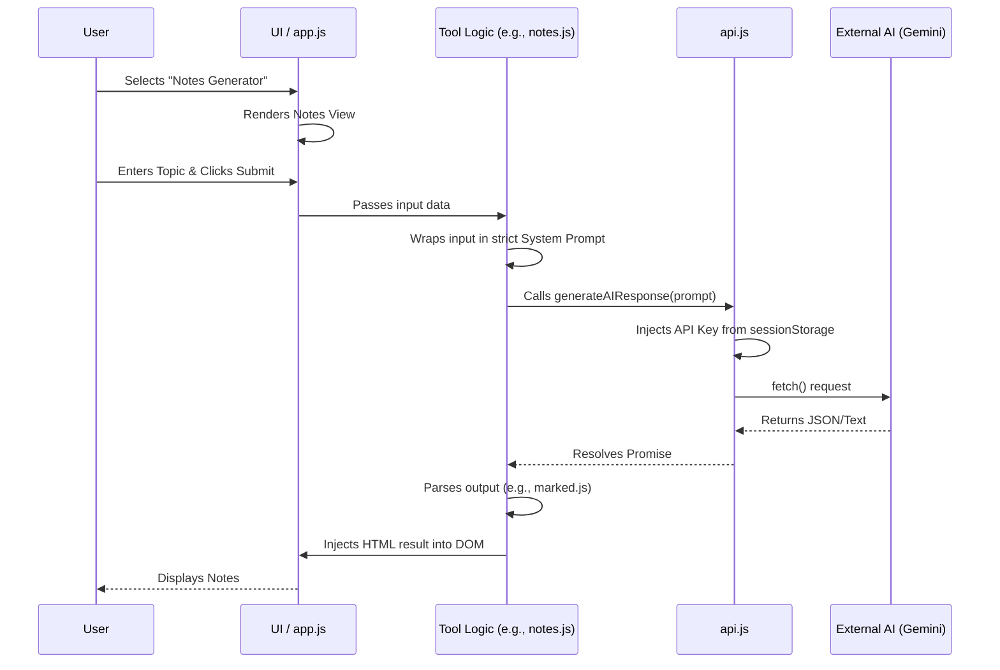

# AI Study Hub - Architecture Document

## 1. Overview
The **AI Study Hub** is a unified, single-page web application (SPA) that combines 8 distinct AI-powered educational tools into one cohesive platform. It is designed to act as an all-in-one assistant for students.

**Included Modules:**
1. AI Resume Builder
2. AI-Powered Notes Generator
3. AI Presentation (PPT) Generator
4. AI Mind Map Generator
5. AI Subject Doubt-Solving Chatbot (Task 7)
6. AI Flashcard Generator (Task 8)
7. AI Study Planner (Task 9)
8. AI Notes Summarizer with OCR (Task 10)

*(Tasks 5 and 6 have been excluded as requested).*

---

## 2. Technology Stack
*   **Structure:** HTML5 (Semantic UI)
*   **Styling:** Vanilla CSS3 (Custom Design System, Glassmorphism, CSS Variables, Flexbox/Grid)
*   **Logic:** Vanilla JavaScript (ES6 Modules)
*   **External Libraries (Loaded via CDN):**
    *   `marked.js` (For rendering Markdown notes)
    *   `jsPDF` (For Resume/Notes export)
    *   `tesseract.js` (For client-side OCR processing)
    *   `FontAwesome` (For UI iconography)

---

## 3. Directory Structure
To keep the codebase maintainable, the application is divided into modular files:

```text
/
├── index.html          # Main application shell (Sidebar + Content Container)
├── css/
│   └── style.css       # Global design system, animations, and tool-specific styles
├── js/
│   ├── app.js          # Core logic (Navigation, View switching, API Key Auth)
│   ├── api.js          # Centralized LLM API caller (e.g., Gemini)
│   └── tools/          # Individual tool logic modules
│       ├── resume.js
│       ├── notes.js
│       ├── presentation.js
│       ├── mindmap.js
│       ├── chatbot.js
│       ├── flashcards.js
│       ├── planner.js
│       └── ocr_summarizer.js
```

---

## 4. Application Architecture

### 4.1. The Shell (UI Layout)
The UI follows a classic dashboard layout:
*   **Sidebar (Left):** Contains navigation links for the 8 tools and an input field at the bottom to configure/store the AI API Key.
*   **Main View (Right):** A dynamic container where the active tool's HTML is injected or toggled via JavaScript.

### 4.2. State & API Key Management
*   The application requires a valid API key (e.g., Google Gemini) to function.
*   The key is stored in the browser's `sessionStorage`.
*   If a tool is triggered without a key, the `api.js` module catches it and triggers a UI alert prompting the user to enter their key in the sidebar.

### 4.3. Data Flow (Sequence)


---

## 5. UI/UX Design System
*   **Theme:** Deep dark mode with vibrant neon accents (Premium Developer Aesthetic).
*   **Components:** Frosted glass panels (`backdrop-filter: blur()`), smooth transitions between tool views, and interactive micro-animations on buttons and inputs.
*   **Responsiveness:** CSS Grid and Flexbox ensure the sidebar collapses into a hamburger menu on mobile devices.
