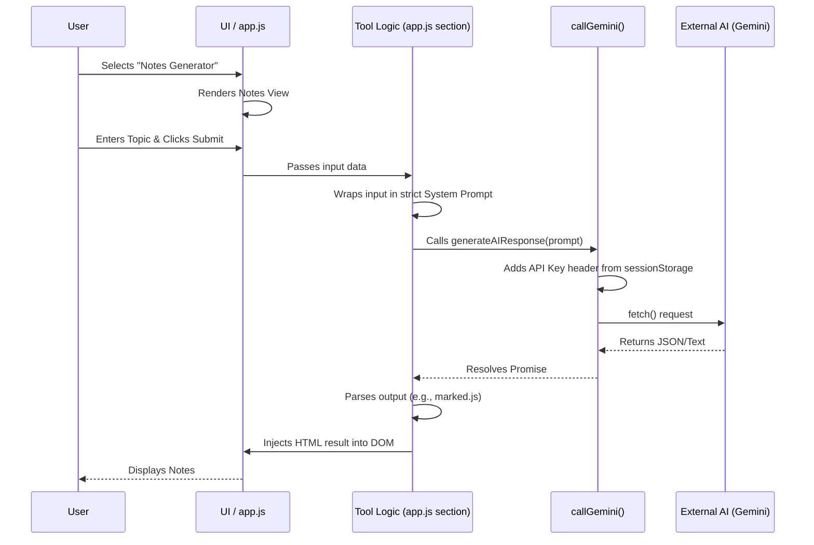

# AI Study Hub - Architecture Document

## 1. Overview
The **AI Study Hub** is a unified, single-page web application (SPA) that combines the 10 AI-powered educational tools from `AI_Classroom_Tasks.docx` into one cohesive platform. It is designed to act as an all-in-one assistant for students.

**Included Modules:**
1. AI Resume Builder (form incl. objective, sample profiles, PDF export)
2. AI-Powered Notes Generator (Markdown render, copy, .txt/.pdf download)
3. AI Presentation (PPT) Generator (5-6 JSON slides, prev/next, .pptx export via PptxGenJS)
4. AI Mind Map Generator (markmap, zoom/pan, click a node for AI detail)
5. Google Sheets Backend (Apps Script `doGet`/`doPost` in `apps-script/Code.gs`, AI insight)
6. AI Quiz / MCQ Generator (5-10 questions, instant feedback, final score)
7. AI Subject Doubt-Solving Chatbot (subject-specific system prompt, multi-turn history)
8. AI Flashcard Generator (8-10 cards, 3D flip, next/prev/shuffle)
9. AI Study Planner (exam dates, colour-coded day x time grid, regenerate)
10. AI Notes Summarizer with OCR (Tesseract.js extract -> edit -> summarize)

---

## 2. Technology Stack
*   **Structure:** HTML5 (Semantic UI)
*   **Styling:** Vanilla CSS3 (Custom Design System, Glassmorphism, CSS Variables, Flexbox/Grid)
*   **Logic:** Vanilla JavaScript (ES6 Modules)
*   **External Libraries (Loaded via CDN):**
    *   `marked.js` (For rendering Markdown notes)
    *   `jsPDF` (For Resume/Notes export)
    *   `tesseract.js` (For client-side OCR processing)
    *   `markmap-lib` / `markmap-view` + `d3` (For mind map rendering)
    *   `PptxGenJS` (For .pptx export)
    *   `DOMPurify` (For sanitizing AI-generated HTML)
    *   `FontAwesome` (For UI iconography)

---

## 3. Directory Structure
```text
/
├── index.html          # Main application shell (Sidebar + all 10 tool views)
├── css/
│   └── style.css       # Global design system, animations, and tool-specific styles
├── js/
│   └── app.js          # Navigation, API key, centralized Gemini caller, and one section per tool
└── apps-script/
    └── Code.gs         # Google Apps Script Web App backing the Sheets tool
```

---

## 4. Application Architecture

### 4.1. The Shell (UI Layout)
The UI follows a classic dashboard layout:
*   **Sidebar (Left):** Contains navigation links for the 10 tools and an input field at the bottom to configure/store the AI API Key.
*   **Main View (Right):** A dynamic container where the active tool's HTML is injected or toggled via JavaScript.

### 4.2. State & API Key Management
*   The application requires a valid API key (e.g., Google Gemini) to function.
*   The key is stored in the browser's `sessionStorage`.
*   If a tool is triggered without a key, `callGemini()` in `app.js` catches it and triggers a UI alert prompting the user to enter their key in the sidebar.

### 4.3. Data Flow (Sequence)


---

## 5. UI/UX Design System
*   **Theme:** Deep dark mode with vibrant neon accents (Premium Developer Aesthetic).
*   **Components:** Frosted glass panels (`backdrop-filter: blur()`), smooth transitions between tool views, and interactive micro-animations on buttons and inputs.
*   **Responsiveness:** CSS Grid and Flexbox ensure the sidebar collapses into a hamburger menu on mobile devices.
